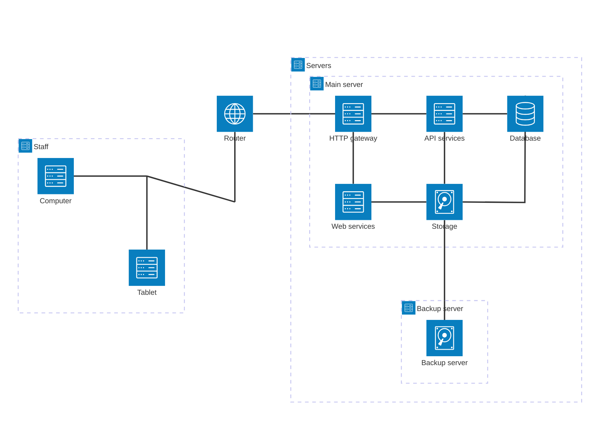

# Usage

This page explains how to get started with rehua.

## Deployment steps

1. Install docker on the server
2. Download the `docker` folder from [BozhanL/rehua-doc](https://github.com/BozhanL/rehua-doc). You can either run `git clone https://github.com/BozhanL/rehua-doc.git` or click <https://github.com/BozhanL/rehua-doc/archive/refs/heads/main.zip> to download entire repository, and delete unwanted files
3. Enter the `docker` folder by `cd docker`
4. (Optional) Edit `nginx/html/create_web.sh` file to choose web version. Default is `main`
5. Execute `nginx/html/create_web.sh` to download and compile the web
6. (Optional) Edit the image version for `api` in `compose.yaml` to match web version. Default is `main`
7. Edit username, password, connection string for mongo in `mongo/mongo_username.txt`, `mongo/mongo_password.txt`, `mongo/mongodb_url.txt`. Default is `admin`
8. Execute `certs/create_test_cert.sh` to create internal certificates
9. Edit `nginx/conf/conf.d/rehua.conf` to change `server_name` to your own domain.
10. Put SSL/TLS certificate and private key to `certs/nginx` folder, and update `ssl_certificate` and `ssl_certificate_key` in `nginx/conf/conf.d/rehua.conf`. The certificate and the key are inside `/cert/` folder
11. Run `docker compose up -d` to start all services.

## Structure diagram

